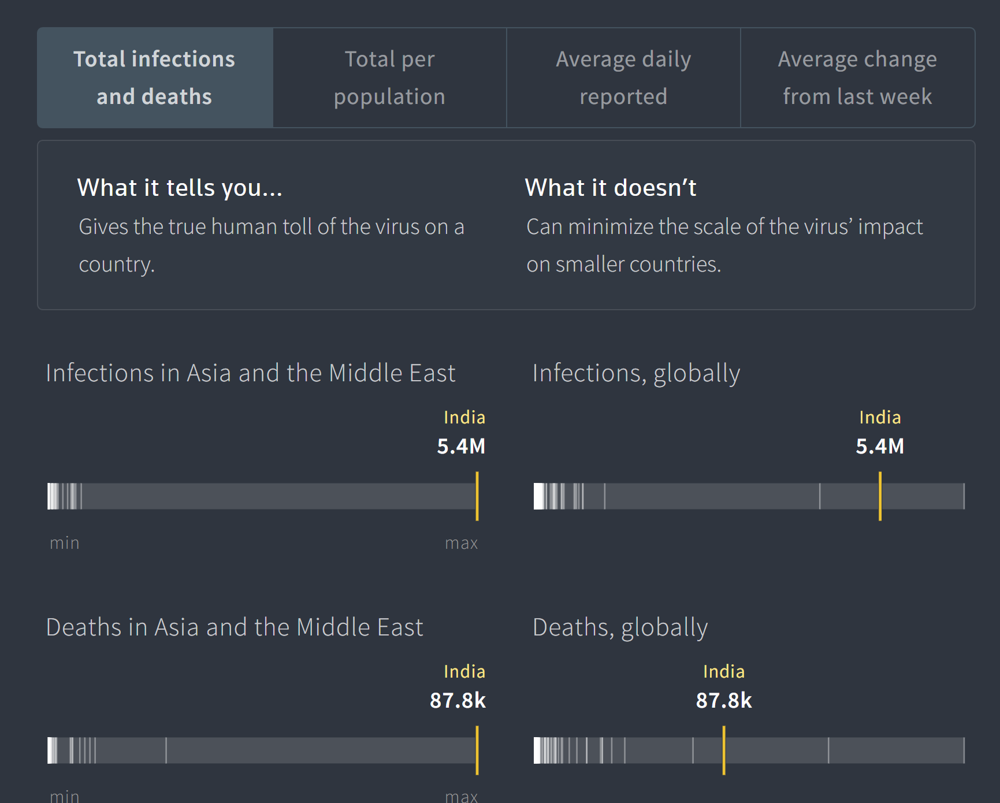
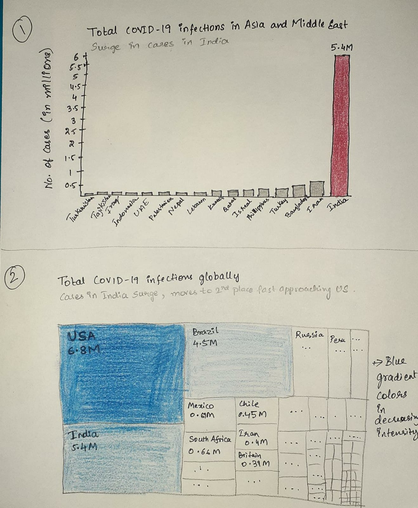

# Assignment 3&4: Critique by Design
# Week 3

### **Original Visualization**
###### Link to the website: https://graphics.reuters.com/world-coronavirus-tracker-and-maps/countries-and-territories/india/

Source: Thomson Reuters COVID-19 Tracker (India) (https://graphics.reuters.com/world-coronavirus-tracker-and-maps/countries-and-territories/india/)
The visuals I am using are the graphs "Infections in Asia and Middle East" and "Infections, globally" under "Total infections and deaths". I thought these same redesigns are also applicable for "Deaths in Asia and Middle East" and "Deaths, globally"

There have been many recent visualizations on COVID-19 cases tracking. As many have been already used to make false assumptions and criticized, there have also been many visuals that provided insights on the progression of the pandemic. As I was keeping track of the number in India as my family lives there, I have come across this website that tracks and highlights India and its position. When I saw it, I immediately wanted to understand and analyze the visualization.

### **Critique, Thought process and Wireframe sketch:**
> - The first thing that stood out to me is the truthfulness in the website, where above the graphs it mentions what the graph represents but most importantly what it **"doesn’t"** and I thought that was very important. But this same aspect again gave me thought on why not just use an appropriate graph like number of cases per capita instead, which might be of a better representation of the pandemic spread. But with the help of critique method, I realized it was not necessary untruthful visual. This gave me an epiphany that sometimes it is important to plot just the number of cases as well and given the context about how the numbers in India have surged, it dismissed by doubt. Similar to some exploratory analysis where simple graphs also give us some much needed insight.
>- What worked for me was the clever, simple and clean representation of the plots. They are not too busy, pleasant to look at, highlights India’s numbers and also give us the basic idea. I have never seen such graph and I was impressed informative it was after spending some time on it.
But what did not work for me is that the other countries were marked as thin gray line with a black background. It took me quite some time to spot them. And then came the next challenge on finding out which line each country was. I searched for some sort of guide/legend to decipher it until I hovered over them and found the names popping up. This does work for an interactive graphic but for a static visual, I thought there was far too less information except India’s and left me a little frustrated.
>- When I was critiquing each aspect of the visual, I also simultaneously starting thinking what change would increase the score. Then I came up with a few mental images of changes that would work better and started sketching them like changing background color or the color for other countries in order to get a contrast. I believe that this graph is less intuitive, unfamiliar and is not necessarily extremely easy to understand quickly especially for general public. So, I thought I would rather use a column or a horizontal bar chart which shows the differences quickly. But a bar/column was global cases was proving to be different due to number of countries to be displaced. So I thought the focus would be on the Top 10 or 15, which will enable us to understand the position of India. So, I thought using a tree map would be good.
Finally, I came up with the following wireframe/sketch. 

### **Feedback on the sketches**
>To capture the opinion of general public as the intended audience, I got feedback from three different people. All in completely different age groups and careers.
>1. My friend in India
>2. My roommate
>3. My Older brother
>The questions were:
>- Can you tell me what you think this is?
>- Can you describe to me what this is telling you?
>- Is there anything you find surprising or confusing?
>- Who do you think is the intended audience for this?
>- Is there anything you would change or do differently?
>- Approximately how much time did it take for you to understand the main point?

>The answers for the column graph was almost exactly as I was hoping. The main point was easily conveyed within a time ranging from 5-10 seconds. One feedback I received from my friend was that the countries with low numbers are occupying a lot of space and the white space is too much because of that. So, I have thought of an idea to not emphasize that in the first glance by filtering top countries (with more than 20,000 total cases) and trying a horizontal bar chart.

>The answers for the tree map ranged from "I know exactly what it is and what it means" to "I have no idea what that plot is but I know what it means with an average time of 1 minute. So I was satisfied that it was in higher end of "Intuitive" spectrum but not in the lower or middle. Changes suggested were either using the per-capita graph or changing the color scheme of the blue. I have changed the color scheme and as for the per-capita cases, it would need additional information that is not in the dataset and I did not want to change the dataset but work with the same one to create a better plot. So, I did not make any other changes.

### **Final Visuals:**
>After the necessary changes, these are the final visuals that might be easier to understand for the context.

<iframe src="https://public.tableau.com/views/assignment3_16009105626970/Sheet3?:showVizHome=no&:embed=true" width="100%" height="500"></iframe>

<iframe src="https://public.tableau.com/views/assignment3_1_16009106979950/Sheet1?:showVizHome=no&:embed=true" width="100%" height="500"></iframe>

Data Source: [Oxford Coronavirus Government Response Tracker](https://www.bsg.ox.ac.uk/research/research-projects/coronavirus-government-response-tracker)
