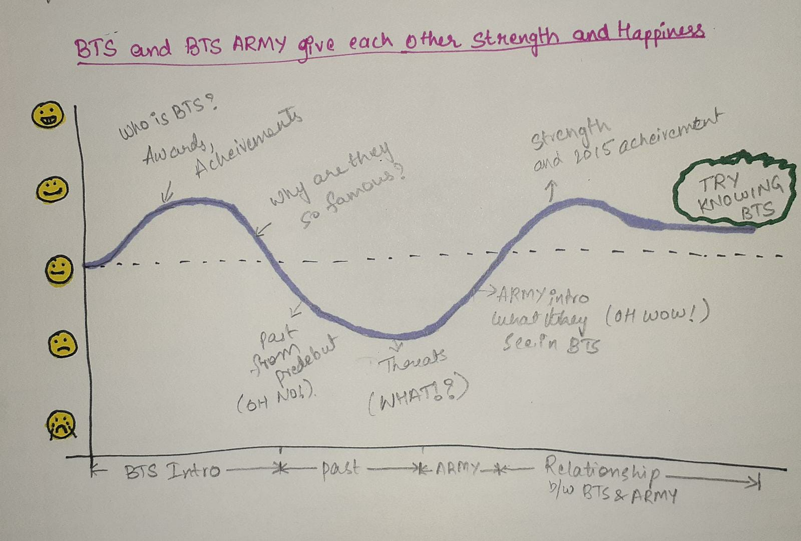
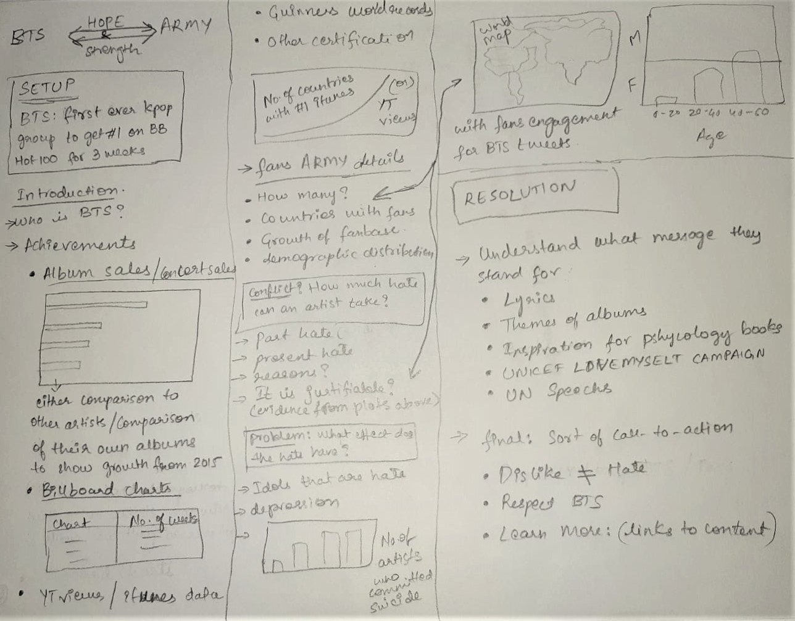

# Final Project
#### Name: Kamaneeya Kalaga
#### Andrew ID: kkalaga

## Part 1
### 1. Outline
**Summary:** 
> Come on a journey with me to know about BTS, a seven member South-Korean Boy group and how despite the amount of criticism, hate and belittlement, BTS and their fans ARMY have given each other strength and hope to succeed. "ARMY doesn't want to force everyone to like BTS. All the fans can hope is that others can respect BTS as artists and human beings."

**Project Structure:**
- *Setup:* Global success, awards, certifications and acheivements of BTS. BTS are a global phenomenon.
- *Conflict:* Unnecessary hatred and stereotypical belittling comments against BTS sadlystill exists.  
- *Resolution:* Understanding what they represent and respecting them might be the only solution.

From the below story arc, I am exppecting my readers to firstly be shocked about the success. When the comparison to Beatles is mentioned, I expect them to be a little critical or not convinced about why BTS is so successful. When I mention the hate, I believe they would sympathize a little and then become sad when I mentioned the effects hate has on the artists' miind. I would then bring their mood up by saying why fans are so connected and the things thwy did to lift BTS up and support them during those times. FInally I would talk about what is expected from the readers, either to learn more about BTS if they like them or atleast respect them as artists, which could either be a positive or a neutral reaction respectively.

### 2. Sketches
I sketched my story structure using the method given in the text book and the image is below.

### 3. Data Sources
The following are my data sources. I will either manually create an excel or scrape the website to get the data. All the data is publicly available and can be seen in the websites. I will use a current number of each file while making the project but update the values again on the submission date of the final project to reflect accurate numbers.
The following links are used to showcase the current success of BTS
>Spotify Streams CSV file from: **[Link 1](https://btschartdata.glitch.me/)**

>Billboard charts data: **[Link 2](https://www.billboard.com/charts)**

>iTunes data: **[Link 3](https://kworb.net/itunes/artist/bts.html)**

>YouTube Views: **[Link 4](https://kworb.net/youtube/artist/bts.html)**

These remaining sources are used to show the growth from older albums/compared to other artists from 2013 to present. Doing this wil show how fast their success was and how impactful they have become now.
>Albums sales by country: **[Link 5A](https://bts.fandom.com/wiki/Sales_and_Certifications) OR [Link 5B](https://chartmasters.org/2020/09/bts-albums-and-songs-sales/)**

>Comparing different artists: **[Link 6](http://kpop.aoimirai.net/artists.html)**

The last source that I am planning to use is from a survey research who stated that we are free to use the data. I will be using it to show some fans demographics which is a key evidence for one of the sterotype that BTS faces regarding their fans. The data is sent to us upon request. I have aready requested them for the data and will be receiving it soon. The following is the link to their website.
>BTS ARMY CENSUS: **[Link 7](https://www.btsarmycensus.com/)**

### 4. Method and Medium
I will be building my story using Shorthand. I would like to experiment with the templates to see the best layout of create my own layout that best fits my story. I want to use a purple color palette for the background due to its importance related to BTS. Images will be taken from official BTS and BIGHIT Labels Twitter account and website to compliment the story where ever needed. 
I will mainly focus on Tableau and/or Flourish for my visualizations with a color palette that compliments the backgroud. I will use colorbrewer2.org to experiment with suitable color palettes
Another important tool for this project will be Excel and Python for data extraction and cleaning.
