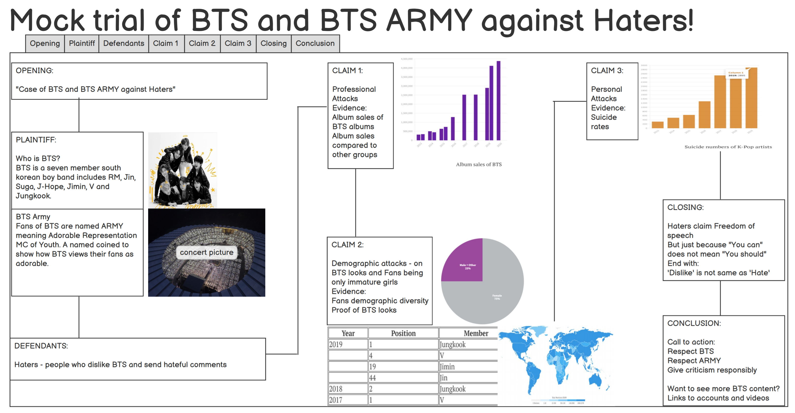

# Final Project
#### Name: Kamaneeya Kalaga
#### Andrew ID: kkalaga

## Part 2
### 1. Wireframe'
> I took a new approach to my story telling here. I wanted to make the readers more relaxed and also given topic, I wanted to present information in an easy to digest manner. So, I thought of a fake moke trial format to present the topic. The wireframe fo that is given below. I had to make a document with few more sentences to help the narrative.
But to clarify, it is a mock trial where claims are what haters are accused of and evidences are BTS achievements which prove that haters are wrong (not the ususal flow). 

### 2. User Research Protocol
**Target audience:**
> People who are not BTS or K-Pop fans, do not respect artists that are not their favorite, has stereotypical ideas.

**Approach to identifying representative individuals to interview:**
> Find people (who are not fans of BTS) of different ages and backgrounds so they have different thinking regarding boybands and artists.

**Interview script**
> Initially, I will start by showing them a picture of BTS (without telling them who they are) and ask for first impressions. This is to know how they feel about them and see if they change their opinions (if only they had bad first impressions.)

|**Goal**|**Questions**|
|---|---|
|Emotional Connection|Are you a fan of anything? If yes, of what?|
||Have you ever experienced hate for others towards your favorite artist? If yes, How did it make you feel?|
|Understanding|Can you tell me what is the problem explained in the story?|
||When do you think the problem occured?|
||Who are the cause of the problem? Who do you think are the victims?|
||What solution is proposed?|
||What do you think you should do?|
||On a scale of 1-10 (1-Not at all and 10-Definitely), would you do what you mentioned?|
|Emotional response|What did you think/feel while reading the story?|
||Did you find anything surprising or significantly emotional?|
|Feedback|Did you find the visuals and data convincing?|
||Did you find anything confusing?|
||Is there anything you would add/change/do differently?|
||If yes for above question,please explain why?|

**Findings from your interviews**
> Below are the results of my user interview.

|**Questions**|**Male,30s**|**Female,20s**|**Male,60s**|
|---|---|---|---|
|*First impressions on fan culture*|Neutral|Positive|Positive|
|*Are you a fan of anything? If yes, of what?*|soccer Fan - Chelsea|Indian music artists|fan of Michael Jackson|
|*Have you ever experienced hate for others towards your favorite artist?*|Yes|Yes|No|
|*If yes, How did it make you feel?*|sometimes angry and other times hilarious|Unfair||
|*Can you tell me what is the problem explained in the story?*|Exploiting freedom of speech|haters get jealous of BTS's popularity|Haters sending hate to BTS|
|*When do you think the problem occured?*|From 2010 until present|once BTS became famous|Not sure|
|*Who are the cause of the problem? Who do you think are the victims?*|Haters, BTS/celebrities|Cruel people in social media, BTS/ARMY|Haters, BTS/ARMY|
|*What solution is proposed?*|Use social media responsibly|Respect everyone, okay to dislike but not hate|Respect all. But it is really the solution?|
|*What do you think you should do?*|Have the humility to know about the them before criticizing|I am not a hater but I will edicate my friends|Not to hate|
|*On a scale of 1-10 (1-Not at all and 10-Definitely), would you do what you mentioned?*|7|10|10|
|*What did you think/feel while reading the story?*|Written by a passoniate fan|immature haters, sociam media is not used properly|Hate is a tag that comes with fame|
|*Did you find anything surprising or significantly emotional?*|Artists suicide was emotional|Not surprised but felt sympathy for BTS fans|No|
|*Did you find the visuals and data convincing?*|Yes|Yes|Yes|
|*Did you find anything confusing?*|No|No|No|
|*Is there anything you would add/change/do differently?*|Yes (elaborated below)|No|Yes (elaborated below)|
|*Finally, did you impression change?*|Maybe|No|No|

Both the males had a different perspective regarding a few things.
1. First male said that he would prefer a little bit more of deeper touch to BTS's work so that the evidences do not entirely rely on numbers. But still they also wanted me to add a chart showing the age ranges of the ARMY.
2. Second older male mentioned that he thinks that we cannot do anything with the haters. So, the solution must be geared towards the artists reminding them that they just need to ignore haters and carry on with theor work

**Changes I plan on implementing to my visualizations and/or story** 
> I have thought about the part 1 and completely agree with it. I am going to add a section about the fan and artist relationship in the intro and explain what makes it is so special. I will also add the visualization of age group distribution of the fans

> I am not entirely sure if I agree with the second male. Although I get their point, I think that is only one side of the coin. I still believe that the solution must be focused on what we all should do to prevent things from going bad. I do agree that this is also only one side of the coin, I am sure the entertainment companies managing the artist will take of the second side of it (which is what second male suggests). So I might add this point to clarify but will not make any major changes to solution.
